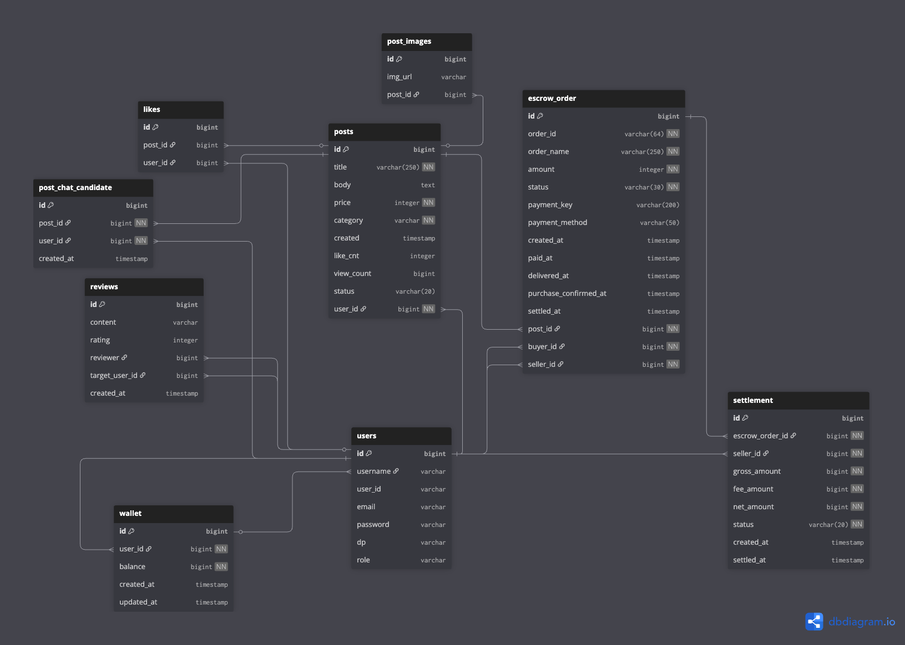
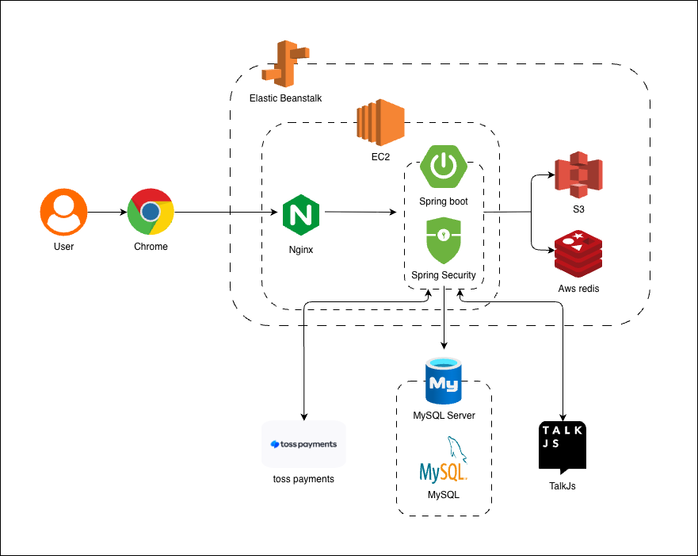
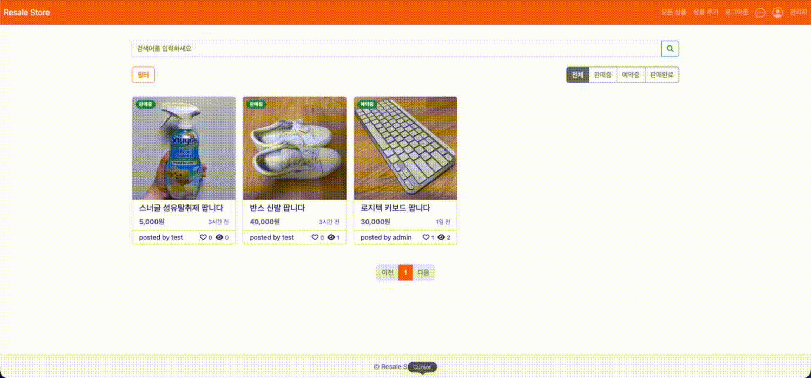
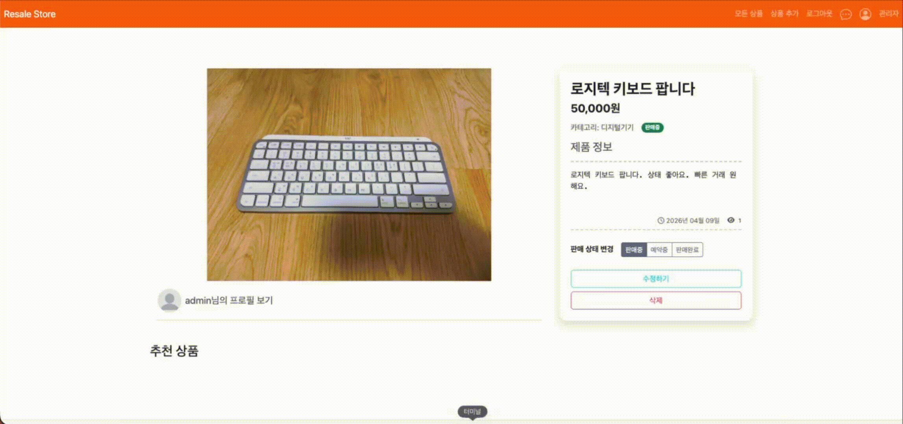
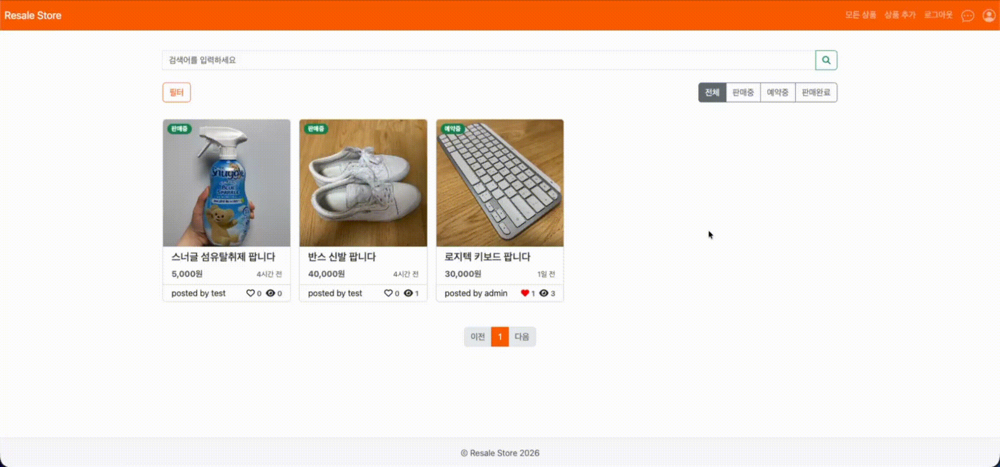
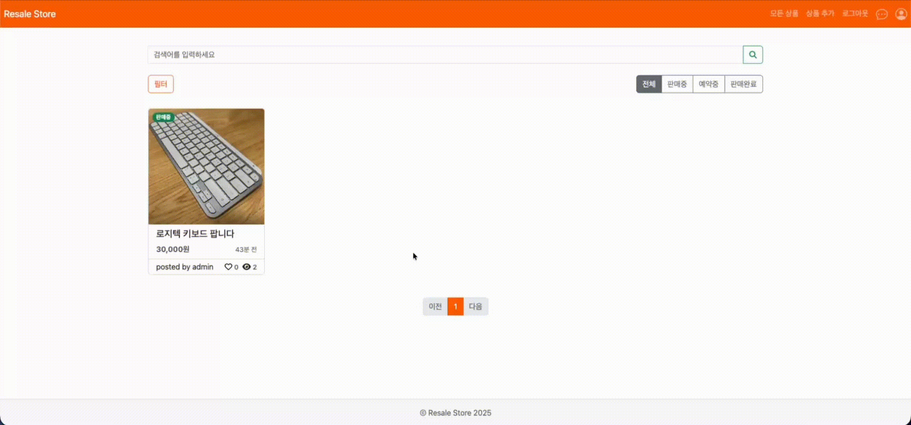

# ResaleStore
* 목표: 게시글 기반 중고거래 서비스로, 게시글 등록/수정/삭제 및 검색, 필터, 정렬, 상태(판매중/예약중/판매완료) 관리, 좋아요, 리뷰(별점), TalkJS 채팅을 제공하며 결제(Toss Payments)➡️에스크로➡️정산(지갑) 흐름까지 포함한 안전 거래를 구현
* 핵심 포인트: JWT(쿠키) 인증 + Spring Security, JPA 기반 데이터 처리, Redis(조회수/최근 본 글/추천 상품), S3 Presigned URL 업로드, Toss Payments 연동

## 1. ERD

## 2. 시스템 아키텍처

## 3. 주요 기능
### 🔎 게시물 탐색
> 사용자가 원하는 상품을 빠르게 찾을 수 있도록 검색, 필터, 정렬, 추천 기능을 한 화면에서 사용할 수 있게 구성했습니다.
* FullText Index를 사용한 제목 기반 검색 지원
* Redis 기반 조회수와 좋아요 정보를 함께 표시

* 카테고리, 가격 범위, 상태, 정렬 조건 조합 필터링

* Redis Sorted Set을 활용한 인기 게시글 및 카테고리별 추천 제공

---

### ✍🏻 게시글 등록 및 수정
> 단순 CRUD를 넘어서 이미지 업로드와 상태 관리를 실제 서비스 흐름처럼 다룰 수 있도록 구현했습니다.
* S3 Presigned URL 발급 후 클라이언트가 S3에 직접 업로드
* 다중 이미지 등록 지원
* 판매중, 예약중, 판매완료 상태 관리

* 수정 시 기존 이미지 삭제와 신규 이미지 업로드를 함께 처리

---

### 💰 결제 및 에스크로 기반 안전 거래
> 결제 이후의 거래 상태 변화와 정산까지 이어지는 중고거래 핵심 플로우를 서비스 안에서 관리할 수 있도록 구성했습니다.
* Toss Payments 위젯 연동 및 서버 검증 처리
* 결제 완료 후 게시글 상태를 예약중으로 자동 전환

* 직거래 거래 완료 시 채팅을 통해 대화한 사용자 중 실제 구매자를 선택하여 판매 완료 처리

* 배송 중, 구매 확정, 정산까지 단계별 에스크로 라이프사이클 관리
* 구매 확정 시 수수료 제외 후 판매자 지갑으로 자동 정산

---

### ⚙️ 마이페이지와 계정 보호
> 사용자 개인 설정과 민감 작업 보호 절차를 함께 설계해 계정 관리 경험을 강화했습니다.
* 내 게시글, 좋아요 목록, 최근 본 게시글, 구매/판매 내역, 정산 내역 조회
* 프로필 이미지 변경 기능 제공

* 이메일과 비밀번호를 다시 검증한 뒤 임시 토큰을 발급해 비밀번호 변경, 계정 삭제 같은 민감 작업 보호

---

### 📝 리뷰 및 사용자 신뢰도
> 거래 이후 리뷰를 남길 수 있도록 사용자 신뢰도를 쌓는 흐름을 구현했습니다.
* 사용자 프로필 페이지에서 게시글/리뷰 탭 구성
* 평점과 텍스트를 함께 남기는 리뷰 작성 기능
* 일반 사용자와 관리자 삭제 권한을 분리한 리뷰 삭제 처리

---

### 👨🏻‍💻 관리자 운영 기능
> 운영자가 사용자, 게시글, 리뷰를 한 곳에서 관리할 수 있도록 관리자 전용 화면과 대시보드를 구성했습니다.
* 사용자 수, 게시글 수, 리뷰 수, 좋아요 수 통계 확인
* 사용자 검색과 게시글 검색/필터/페이지네이션 지원
* 관리자 권한 기반 게시글 삭제 및 리뷰 관리

---

### 💬 실시간 채팅
> 게시글 작성자와 구매 희망자가 바로 대화를 시작할 수 있도록 TalkJS를 연동했습니다.
* 게시글과 사용자 정보를 기반으로 1:1 대화방 생성
* inbox 형태의 대화 목록 및 대화 화면 제공

---

### 📚 기타 구현 기능
* 회원가입 시 유효성 검사와 중복 체크 후 자동 로그인 처리
* 로그인 성공 시 JWT HttpOnly 쿠키 발급, `JwtFilter`로 인증 처리
* 좋아요 토글 시 게시글 `likeCnt` 동기화 및 추천 점수 갱신
* 게시글 상세 화면에서 이미지 슬라이드, 채팅 이동, 상태 변경 액션 제공
* 게시글 삭제 시 권한 체크 후 S3 이미지, 좋아요, DB 데이터를 함께 정리

## 4. 보안/품질
* SQL Injection 점검
* Repository에서 파라미터 바인딩 방식(JPA)을 사용하여 SQL Injection 위험을 낮춤
* CSRF
* HttpSessionCsrfTokenRepository로 토큰 발급
* JS fetch에서 meta의 CSRF 값을 읽어 헤더로 전송
* 권한/인가
* 관리자: /admin/** 보호
* 일반 기능: @PreAuthorize("isAuthenticated()") 기반 보호
* 프로파일 분리(dev/prod)
* prod: Swagger 비활성화, ddl-auto validate, SQL 로그 최소화

## 5. API 명세서
[API 명세서](https://thinkable-earthquake-735.notion.site/Resale-Store-API-2e7a5166124c800c861dfa772bbac7c0?source=copy_link)

## 6. 트러블 슈팅
[트러블 슈팅](https://thinkable-earthquake-735.notion.site/2eea5166124c80f88b1bcf93f60225f0?source=copy_link)

## 7. 기술스택
### 백엔드

-85EA2D?style=for-the-badge&logo=swagger&logoColor=black)

### 프론트엔드

### Environment & Etc

